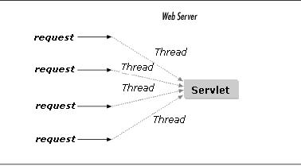

# Aula 01 
*Lembrete:* .class é um arquivo java já compilado (bytecode)

### O que é thread?
É um programa que trabalha como subsistema (sendo uma unidade de um processo). Assim, multíplas tarefas podem ser executadas rodando mais rapidamente do que se fossem escritas em um bloco.

**Onde são aplicadas?**
- otimizar uso de CPU
- receber multiplas requições 

*Lembre da definição de processo de um sistema operacional, por exemplo*



## Em Java
é um objeto da classe ```java.lang.Thread```.
Uma Thread possui um método ```run()```, que define o trabalho que será executado pela Thread. 
Entretanto, a thread não vai rodar em paralelo a outras sem o comando ```Thread.start()``` que a inicializa, pois o run **não cria** uma nova thread.
```python
public class exemploBasico extends Thread {
    private boolean fim=false;

Definição de quando ela se encerra, ATENÇÃO isso não mata a thread apenas encerra o while

    public void morra (){
        this.fim=true;
    }

    @Override
    public void run ()
    {
        while (!this.fim) {
                O que ela deve fazer quando executada
            }
        }
    }
```

### Implementação 

```python
public class TarefaDoTipo3 extends Inutil implements Runnable
{
A instância dessa classe será a tarefa executada pela Thread
    private Thread  tarefa = new Thread (this);
    private boolean fim    = false;
    
    public void start ()
    {
        this.tarefa.start();
    }

    public void morra ()
    {
        this.fim=true;
    }

    @Override
    public void run ()
    {
        char caractere='0';
        while (!this.fim)
        {
            Atividade executada
        }
    }
}

```
**Por que o uso do ```extends Inutil``` se Inutil é uma classe vazia?**
Porque o Java não permite a herança de múltiplas classes (entretando como o ```Runnable``` já faz parte da classe ```Thread``` também poderia ser ```extends Thread implements Runnable```)

No caso do exemplo, a classe é *uma tarefa que pode ser executada como Thread*.

**O que é o start()?**
```this.tarefa.start()``` faz parte da classe ```Thread``` e é ela que inicia/cria a TarefaDoTipo3 como thread e o ```run()``` faz com que ela rode. Cada start faz uma nova thread ser criada.
ATENÇÃO: ele não pode ser chamado duas vezes na mesma thread.

**Fluxo:**
```
tarefa.start() 
↓ 
this.tarefa.start() 
↓ 
Thread começa sua execução 
↓ 
run() 
↓ 
atividade da tarefa
```

